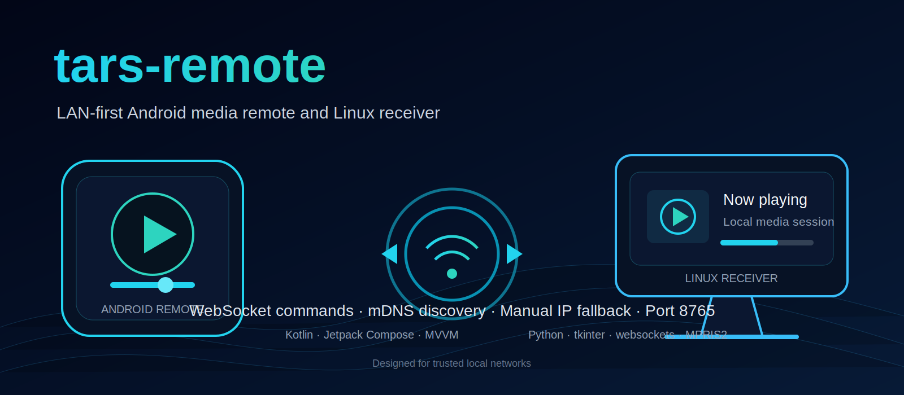

<p align="center">
  
</p>

# tars-remote

A LAN-first media-control system that connects an Android remote to a Linux desktop receiver over WebSockets.

The project is an MVP for controlling a compatible desktop media session from a phone on the same local network. It supports automatic discovery where available and manual IP entry as a fallback.

> The banner is conceptual artwork and may not reproduce the exact application UI. The implementation currently assumes a trusted local network.

## Components

| Component | Stack | Responsibility |
|---|---|---|
| Android remote | Kotlin, Jetpack Compose, Material 3, MVVM, coroutines, OkHttp | Discover or connect to a receiver, send media commands, and show connection state. |
| Linux receiver | Python, tkinter, `websockets`, Zeroconf/mDNS | Accept remote commands and translate them into desktop media-control actions. |
| Media integration | Linux MPRIS2 | Read and control compatible media players. |

## How it works

```text
Android remote
      │
      │ mDNS discovery or manual IP
      ▼
WebSocket connection on port 8765
      │
      ▼
Python receiver
      │
      ▼
Linux media session through MPRIS2
```

The receiver advertises itself on the LAN, listens for WebSocket messages, and delegates supported commands to the local platform controller.

## Current capabilities

- Receiver discovery on the local network
- Manual IP connection fallback
- Play, pause, previous, next, seek, and volume-oriented controls
- Receiver status and connection feedback
- Android Compose interface
- Desktop receiver interface
- A single configurable network port, defaulting to `8765`

## Repository structure

```text
.
├── app/                  # Android application
├── receiver/             # Python Linux receiver
├── gradle/               # Gradle wrapper support
├── build.gradle.kts
├── settings.gradle.kts
└── README.md
```

Key implementation areas include:

- `MainActivity` and `MainScreen` for the Android UI
- `ConnectionViewModel` for connection and UI state
- `DiscoveryService` for local receiver discovery
- `TarsRemoteClient` for the WebSocket client
- `RemoteServer` for receiver-side connections
- `PlatformController` and `MediaSessionMonitor` for Linux media integration

## Run the Linux receiver

Install tkinter when it is not already available:

```bash
sudo apt install python3-tk
```

Set up and start the receiver:

```bash
cd receiver
chmod +x setup.sh
./setup.sh
python3 main.py
```

The receiver can also be packaged with PyInstaller using the repository's receiver build setup.

## Build the Android app

Requirements:

- Android Studio or a compatible Android SDK installation
- JDK compatible with the Gradle configuration

Build a debug APK:

```bash
./gradlew :app:assembleDebug
```

Install or launch the generated app through Android Studio, connect the phone and receiver to the same LAN, and use discovery or enter the receiver IP manually.

## Protocol overview

Commands are exchanged as small WebSocket messages. The exact payloads in the source are the protocol's current source of truth.

Typical command categories include:

| Category | Examples |
|---|---|
| Playback | play, pause, toggle, previous, next |
| Position | seek or position updates |
| Audio | volume changes |
| Session | connection, player, and status information |

## Network and security scope

The current implementation is intended for **trusted local networks**.

- There is no claim of internet-safe deployment.
- Authentication and transport encryption are not yet the primary focus.
- Do not expose the receiver port directly to the public internet.
- Network isolation or host firewall rules are recommended on shared or untrusted networks.

## Known limitations

- Automatic control depends on a compatible Linux player exposing MPRIS2.
- Discovery behavior can vary with router multicast settings and host firewalls.
- Mobile and desktop UI polish is still evolving.
- Authentication, pairing, encryption, reconnect hardening, and broader platform support remain future work.

## Troubleshooting

**The phone cannot discover the receiver**

- Confirm both devices are on the same subnet.
- Check that multicast or mDNS traffic is allowed.
- Allow port `8765` through the receiver firewall.
- Use manual IP entry when discovery is unavailable.

**The receiver connects but media does not respond**

- Confirm the active player supports MPRIS2.
- Verify the receiver process has access to the user's desktop session.
- Review the receiver logs for command or media-session errors.

## Project status

This is an experimental, working MVP rather than a production-ready remote-control product. The repository is useful for exploring Compose networking, service discovery, WebSocket control flows, Linux desktop integration, and cross-device state handling.
